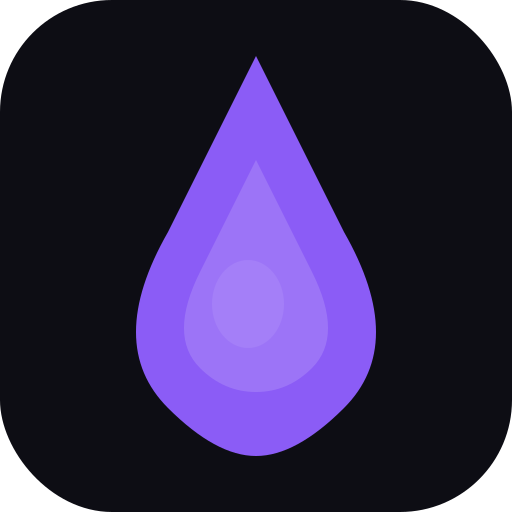

# ProdForge

<p align="center">
  
</p>

<p align="center">
  <strong>The AI-powered operating system for Product Managers.</strong>
</p>

<p align="center">
  <a href="https://github.com/riverphoenix/prodforge/releases/latest">Download for macOS</a> &bull;
  <a href="https://prodforge.app">Website</a> &bull;
  <a href="#features">Features</a> &bull;
  <a href="#installation">Install</a> &bull;
  <a href="#contributing">Contribute</a>
</p>

---

ProdForge is a native desktop app that combines AI-driven frameworks, autonomous agents, and a built-in Claude Code terminal into one tool for Product Managers. Built with Tauri v2, React 19, and multi-model LLM support.

## Features

- **45+ PM Frameworks** — RICE, SWOT, JTBD, Business Model Canvas, Porter's Five Forces, and more. AI generates structured outputs from your project context. Manage categories, edit names/icons, and export as Markdown files.
- **AI Chat** — Multi-provider conversations with OpenAI, Anthropic Claude, Google Gemini, and local Ollama models. Context-aware with project documents.
- **30+ PM Skills** — Pre-built skills across 8 categories (Strategy, Research, Execution, Leadership, Growth, GTM, AI, Career). Manage view with category sidebar, export/import as `.md` files, and per-skill provider+model selection.
- **6 AI Agents** — PRD Writer, Strategy Advisor, User Researcher, Competitive Intel, Growth PM, Launch Captain. Create custom agents with skills and system prompts. Manage view with export/import as `.md` files, and combined provider+model dropdown showing only configured providers.
- **Agent Teams** — Compose agents into teams with sequential, parallel, or conductor orchestration. Visual drag-and-drop canvas with React Flow.
- **Claude Code Terminal** — Built-in PTY terminal with full Claude Code integration, UTF-8 support, and multiple tabs.
- **Workflow Builder** — Chain frameworks and prompts into repeatable multi-step pipelines. Schedule with cron expressions.
- **30+ Prompt Templates** — With `{variable}` substitution and auto-detection. Category management, export as Markdown.
- **Context Engine** — Upload PDFs, URLs, and Google Docs as AI context for every conversation and generation.
- **File Explorer** — Hierarchical folders with Monaco code editor.
- **Outputs Library** — Save, search, edit inline, and export generated frameworks.
- **Git Versioning** — Auto-commit every output with diff viewer and rollback.
- **Jira & Notion Export** — Push outputs directly to external tools.
- **Marketplace Export/Import** — Export frameworks, prompts, skills, and agents as portable `.md` files with YAML frontmatter. Import with conflict detection and resolution.
- **Analytics Dashboard** — Token usage trends, cost breakdowns, agent performance, CSV export.
- **Tracing** — Hierarchical span recording with timeline visualization for all executions.
- **Embedded AI Server** — The Python sidecar auto-launches inside the app. No manual setup required.

## Tech Stack

| Layer | Technology |
|-------|-----------|
| Desktop | Tauri v2 (Rust backend, WKWebView on macOS) |
| Frontend | React 19, TypeScript, Tailwind CSS v4, Vite |
| AI Sidecar | Python, FastAPI, Pydantic AI |
| Database | SQLite (30+ tables, CASCADE deletes) |
| LLMs | OpenAI, Anthropic Claude, Google Gemini, Ollama |
| Encryption | AES-256-GCM for API keys |
| Versioning | libgit2 per-project repos |
| Agent Canvas | React Flow (@xyflow/react) |

## Installation

### Download

Grab the latest `.dmg` from the [Releases page](https://github.com/riverphoenix/prodforge/releases/latest). Open the DMG, drag ProdForge to Applications, and launch.

**Important — macOS Gatekeeper:** Since ProdForge is not notarized with an Apple Developer certificate, macOS will block the first launch. To bypass:

1. Open the DMG and drag ProdForge to Applications
2. **Right-click** (or Control-click) on ProdForge in Applications and select **Open**
3. Click **Open** in the dialog that appears
4. Alternatively, run: `xattr -cr /Applications/ProdForge.app` in Terminal before launching

### Build from Source

**Prerequisites:**
- macOS 10.15+ (Apple Silicon or Intel)
- [Rust](https://rustup.rs/) 1.70+ with `cargo`
- [Node.js](https://nodejs.org/) 18+ with `npm`
- [Python](https://www.python.org/) 3.10+
- [PyInstaller](https://pyinstaller.org/) (`pip install pyinstaller`)

**1. Clone and install dependencies:**

```bash
git clone https://github.com/riverphoenix/prodforge.git
cd prodforge

# Frontend dependencies
npm install

# Python sidecar dependencies
cd python-sidecar
python -m venv venv
source venv/bin/activate
pip install -r requirements.txt
cd ..
```

**2. Build the Python sidecar binary:**

The AI server is compiled into a standalone binary that gets bundled inside the app.

```bash
cd python-sidecar
source venv/bin/activate
pyinstaller prodforge-sidecar.spec --distpath ../src-tauri/binaries --clean -y

# Rename to match the Tauri target triple
mv ../src-tauri/binaries/prodforge-sidecar ../src-tauri/binaries/prodforge-sidecar-aarch64-apple-darwin
# For Intel Mac, use: prodforge-sidecar-x86_64-apple-darwin
cd ..
```

**3. Run in development mode:**

```bash
npm run tauri dev
```

The app launches with hot-reload for both frontend and Rust changes. The AI sidecar starts automatically inside the app.

**4. Build the distributable (.dmg):**

```bash
npm run tauri build
```

Outputs `ProdForge_1.0.0_aarch64.dmg` in `src-tauri/target/release/bundle/dmg/`.

### Create a Desktop Launcher (alternative to DMG)

If you prefer running from source instead of installing the distributable, create a shell script:

```bash
cat > ~/Desktop/ProdForge.command << 'EOF'
#!/bin/bash
cd ~/path/to/prodforge
npm run tauri dev
EOF
chmod +x ~/Desktop/ProdForge.command
```

Double-click `ProdForge.command` on your Desktop to launch.

### Using Ollama for Free Local AI

[Ollama](https://ollama.ai) lets you run AI models locally with zero API costs.

1. **Install Ollama:** Download from [ollama.ai](https://ollama.ai) or `brew install ollama`
2. **Pull a model:** `ollama pull llama3` (or `mistral`, `codellama`, etc.)
3. **Start Ollama:** `ollama serve` (runs on `http://localhost:11434`)
4. **Configure in ProdForge:** Go to Settings, enter `http://localhost:11434` as the Ollama URL
5. **Select Ollama** as your provider in the Chat model selector

Popular models: `llama3` (8B, fast), `llama3:70b` (70B, better quality), `mistral` (7B), `codellama` (code-focused).

## First Run

1. Launch the app — the setup wizard guides you through initial configuration
2. Enter at least one API key (OpenAI, Anthropic, or Google) in Settings
3. Create your first project and start chatting or generating frameworks
4. For Claude Code terminal access, grant Full Disk Access in System Preferences (the app will guide you)

## Keyboard Shortcuts

| Shortcut | Action |
|----------|--------|
| `Cmd+K` | Command Palette |
| `Cmd+F` | Search |
| `Cmd+1`–`Cmd+8` | Switch tabs |
| `` Cmd+` `` | Toggle terminal |
| `Cmd+B` | Toggle sidebar |
| `Cmd+/` | Keyboard shortcuts |

## Project Structure

```
prodforge/
├── src/                    # React frontend
│   ├── components/         # 60+ UI components
│   ├── pages/              # Page views
│   ├── lib/                # IPC wrappers, types, shortcuts
│   ├── hooks/              # Custom React hooks
│   ├── frameworks/         # 45 framework JSON definitions
│   └── prompts/            # 30 prompt template files
├── src-tauri/              # Rust backend
│   └── src/
│       ├── main.rs         # Entry point
│       ├── lib.rs          # ~240 IPC command registrations
│       ├── commands.rs     # Commands, SQLite schema, business logic
│       └── pty.rs          # Terminal PTY management
├── python-sidecar/         # Python FastAPI server
│   ├── main.py             # API routes
│   ├── agent_engine.py     # Pydantic AI agent execution
│   ├── team_engine.py      # Multi-agent orchestration
│   ├── scheduler.py        # APScheduler-based scheduling
│   ├── tracing_layer.py    # Span-based tracing
│   ├── openai_client.py    # OpenAI streaming
│   ├── anthropic_client.py # Anthropic streaming
│   ├── google_client.py    # Google Gemini streaming
│   ├── ollama_client.py    # Local Ollama
│   └── document_parser.py  # PDF, URL, Google Docs extraction
└── prodforge-icons/        # App and brand icons
```

## Contributing

Contributions are welcome! Here are some ways you can help:

- **Frameworks** — Add new PM frameworks in `src/frameworks/`
- **Skills** — Create new agent skills
- **Bug fixes** — File an issue or submit a PR
- **Documentation** — Improve the docs

Please open an issue first for larger changes so we can discuss the approach.

## License

MIT License — see [LICENSE](LICENSE) for details.
